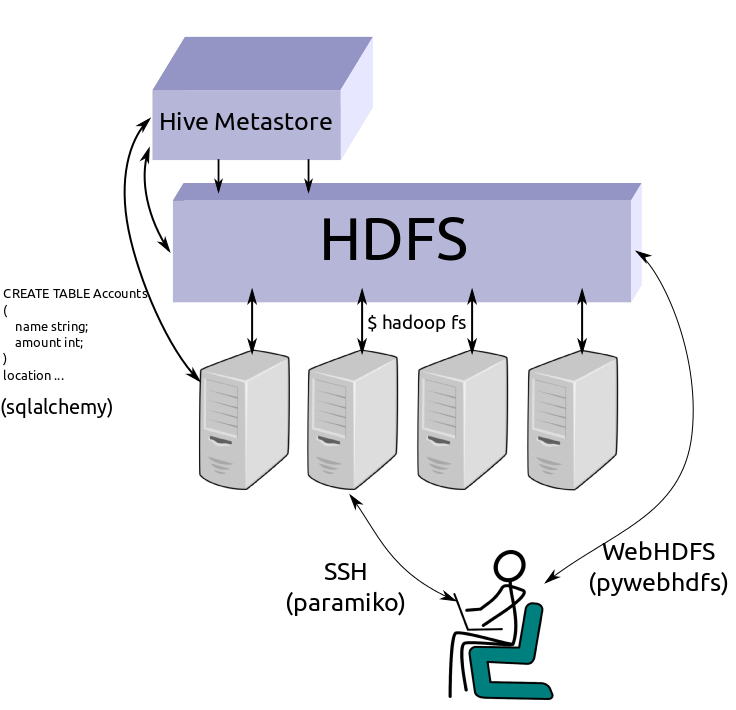

Hadoop File System
==================

Odo interacts with the Hadoop File System using WebHDFS and the ``pywebhdfs``
Python lirary.

URIs
----

HDFS uris consist of the ``hdfs://`` protocol, a hostname, and a filename.
Simple and complex examples follow::

    hdfs://hostname:myfile.csv
    hdfs://username@hostname:/path/to/myfile.csv

Alternatively you may want to pass authentication information through keyword
arguments to the ``odo`` function as in the following example

.. code-block:: python

   >>> from odo import odo
   >>> odo('localfile.csv', 'hfds://hostname:myfile.csv',
   ...     port=14000, user='hdfs')

We pass through authentication keyword arguments to the
``pywebhdfs.webhdfs.PyWebHdfsClient`` class, using the following defaults::

    user_name='hdfs'
    host=None
    port='14000'

Constructing HDFS Objects explicitly
------------------------------------

Most users usually interact with ``odo`` using URI strings.

Alternatively you can construct objects programmatically.  HDFS uses the
``HDFS`` type modifier

.. code-block:: python

   >>> auth = {'user': 'hdfs', 'port': 14000, 'host': 'hostname'}
   >>> data = HDFS(CSV)('/user/hdfs/data/accounts.csv', **auth)
   >>> data = HDFS(JSONLines)('/user/hdfs/data/accounts.json', **auth)
   >>> data = HDFS(Directory(CSV))('/user/hdfs/data/', **auth)

Conversions
-----------

We can convert any text type (``CSV, JSON, JSONLines, TextFile``) to its
equivalent on HDFS (``HDFS(CSV), HDFS(JSON), ...``).  The ``odo`` network
allows conversions from other types, like a pandas dataframe to a CSV file on
HDFS, by routing through a temporary local csv file.::

    HDFS(*) <-> *

Additionally we know how to load HDFS files into the Hive metastore::

    HDFS(Directory(CSV)) -> Hive

The network also allows conversions from other types, like a pandas
``DataFrame`` to an HDFS CSV file, by routing through a temporary local csv
file.::

    Foo <-> Temp(*) <-> HDFS(*)
