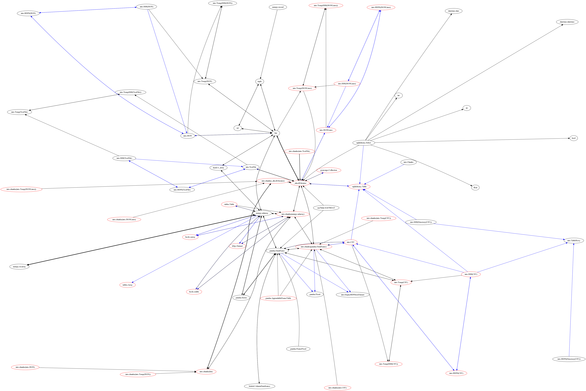

Overview
========

Odo migrates between many formats.  These include
in-memory structures like ``list``, ``pd.DataFrame`` and ``np.ndarray`` and
also data outside of Python like CSV/JSON/HDF5 files, SQL databases,
data on remote machines, and the Hadoop File System.

The ``odo`` function
--------------------

``odo`` takes two arguments, a target and a source for a data transfer.

.. code-block:: python

   >>> from odo import odo
   >>> odo(source, target)  # load source into target

It efficiently migrates data from the source to the target.

The target and source can take on the following forms

.. raw:: html

   <table>
       <thead>
       <tr>
           <td> Target </td>
           <td> Source </td>
           <td> Example </td>
       </tr>
       </thead>
       <tr>
           <td> Object </td>
           <td> Object </td>
           <td> A particular DataFrame or list </td>
       </tr>
       <tr>
           <td> String </td>
           <td> String </td>
           <td> 'file.csv', 'postgresql://hostname::tablename' </td>
       </tr>
       <tr>
           <td> Type </td>
           <td>        </td>
           <td> Like list or pd.DataFrame </td>
       </tr>
   </table>

So the following lines would be valid inputs to ``odo``

.. code-block:: python

   >>> odo(df, list)  # create new list from Pandas DataFrame
   >>> odo(df, [])  # append onto existing list
   >>> odo(df, 'myfile.json')  # Dump dataframe to line-delimited JSON
   >>> odo('myfiles.*.csv', Iterator) # Stream through many CSV files
   >>> odo(df, 'postgresql://hostname::tablename')  # Migrate dataframe to Postgres
   >>> odo('myfile.*.csv', 'postgresql://hostname::tablename')  # Load CSVs to Postgres
   >>> odo('postgresql://hostname::tablename', 'myfile.json') # Dump Postgres to JSON
   >>> odo('mongodb://hostname/db::collection', pd.DataFrame) # Dump Mongo to DataFrame

Network Effects
---------------

To convert data any pair of formats ``odo.into`` relies on a network of
pairwise conversions.  We visualize that network below

   Each node represents a data format. Each directed edge represents a function
   to transform data between two formats. A single call to ``odo`` may
   traverse multiple edges and multiple intermediate formats.  Red nodes
   support larger-than-memory data.

A single call to ``odo`` may traverse several intermediate formats calling on
several conversion functions.  These functions are chosen because they are
fast, often far faster than converting through a central serialization format.
